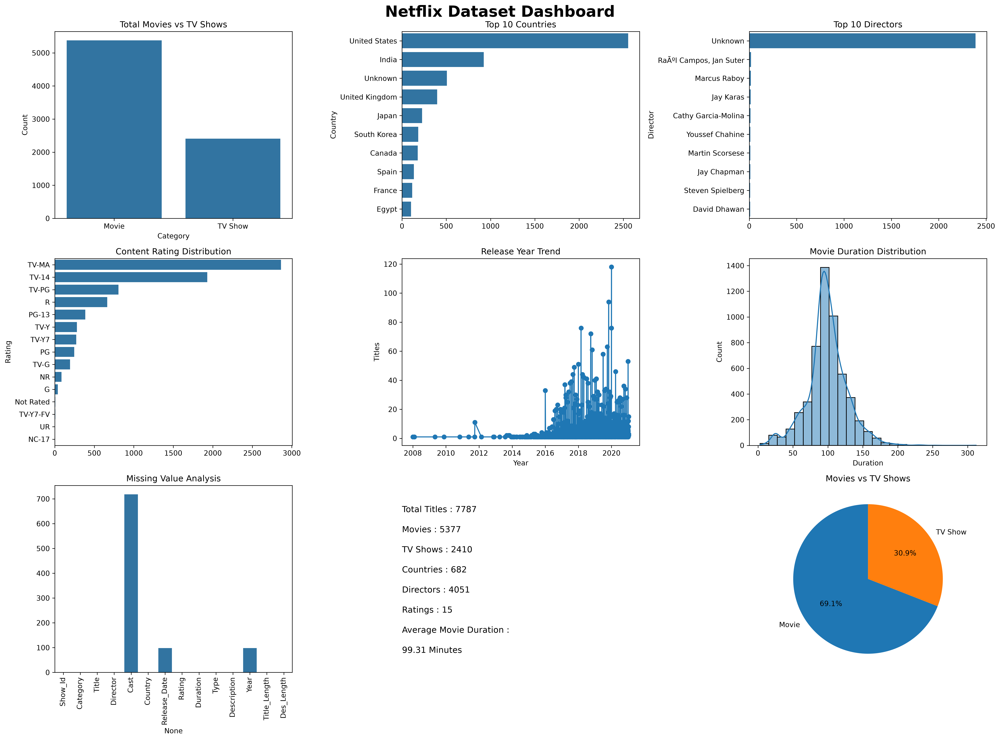

# 🎬 Netflix Data Analysis using Python

A comprehensive Exploratory Data Analysis (EDA) project on the Netflix dataset using **Python**, **Pandas**, **NumPy**, **Matplotlib**, and **Seaborn**. This project focuses on cleaning the dataset, exploring trends, generating business insights, and visualizing Netflix's content library through an `interactive dashboard`.

---

## 📊 Dashboard

> Netflix Dataset Dashboard



---

## 📌 Project Overview

The objective of this project is to analyze Netflix's catalog of Movies and TV Shows to uncover meaningful insights regarding content distribution, release trends, ratings, countries, directors, and movie durations.

The project demonstrates the complete data analysis workflow, including:

- Data Cleaning
- Data Preprocessing
- Exploratory Data Analysis (EDA)
- Data Visualization
- Business Insights
- Dashboard Creation

---

## 🛠️ Technologies Used

- Python
- Pandas
- NumPy
- Matplotlib
- Seaborn
- Jupyter Notebook

---

## 📂 Dataset Information

The dataset contains information about Netflix Movies and TV Shows, including:

- Show ID
- Category (Movie / TV Show)
- Title
- Director
- Cast
- Country
- Release Date
- Rating
- Duration
- Genre (Type)
- Description

---

## 🧹 Data Cleaning

The following preprocessing steps were performed:

- Checked dataset shape and structure
- Identified missing values
- Removed duplicate records
- Converted `Release_Date` to datetime format
- Converted Movie Duration into numeric values for analysis

---

## 📈 Exploratory Data Analysis

The project answers multiple business questions such as:

- Total Movies vs TV Shows
- Top 10 Countries producing Netflix content
- Top Directors
- Distribution of Content Ratings
- Release Trend over the Years
- Longest and Shortest Movies
- Average Movie Duration
- Family-Friendly Content Trend
- Movies vs TV Shows Release Comparison
- Missing Value Analysis
- Director Analysis
- Country-wise Analysis

---

## 📊 Visualizations

The project includes multiple visualizations such as:

- Bar Charts
- Line Charts
- Histogram
- Pie Chart
- Dashboard

---

## 💡 Key Insights

- Movies dominate Netflix's content library compared to TV Shows.
- The United States contributes the highest number of Netflix titles.
- TV-MA is the most common content rating.
- Netflix experienced significant content growth after 2015.
- Movie durations are mostly concentrated between 90–120 minutes.
- Family-friendly content has steadily increased over the years.
- Some directors have contributed to both Movies and TV Shows.

---

## 📁 Project Structure

```
netflix_data_analysis/
│
├── Dashboard/
│   └── netflix_dashboard.png
│
├── Netflix Dataset.csv
├── Netflix Analysis.ipynb
└── README.md
```

---

## 🚀 Future Improvements

- Build an interactive dashboard using Plotly/Dash or Streamlit
- Perform Genre-wise Analysis
- Create Country-wise Heatmaps
- Analyze Actor Collaborations
- Deploy the dashboard as a web application

---

## 👨‍💻 Author

**Dattatraya Samal**

Data Analyst Trainee | MCA Student | Python & Data Analytics Enthusiast

GitHub: https://github.com/mrsamal6969n-cpu

---

# ⭐ If you found this project helpful, consider giving it a star!
